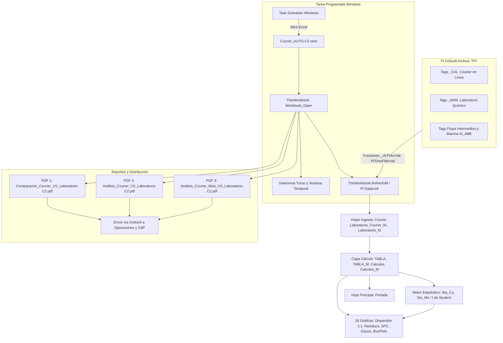
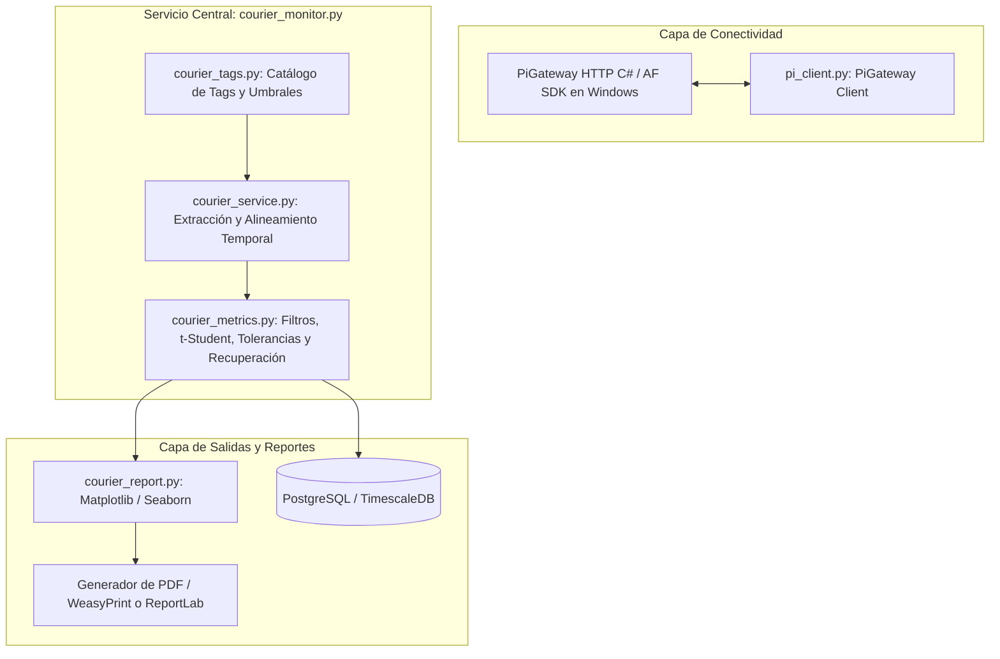

# Análisis Técnico y Especificación de Reemplazo: Courier_AUTO-C2.xlsm

Este documento consolida el análisis de ingeniería inversa detallado del archivo `data/raw/Courier_AUTO-C2.xlsm`, su integración con **PI OSIsoft (PI DataLink)**, la auditoría del código VBA de automatización, la especificación de sus cálculos estadísticos y metalúrgicos (incluyendo el detalle matemático exhaustivo de la prueba $t$ de Student para validación metrológica) y el plan de implementación para migrar este flujo hacia un servicio moderno en Python utilizando `scripts/pi_client.py` y `scripts/pi_tool.py`.

---

## 1. Contexto Operativo y Objetivos

* **Ubicación:** Concentradora Toquepala - Concentradora 2 (C2), Southern Peru Copper Corporation.
* **Procesos Involucrados:**
  * Planta de Flotación de Cobre C2.
  * Planta de Flotación de Molibdeno C2.
* **Objetivo:** Validación metrológica y aseguramiento de calidad (QA/QC) entre:
  1. **Analizadores en línea Courier (XRF):** Medición continua por fluorescencia de rayos X de leyes de Cu, Mo, Fe, Zn, Insoluble en pulpa.
  2. **Laboratorio Químico:** Ensayes analíticos certificados de muestras compuestas recolectadas por turno mediante métodos analíticos estándar (vía húmeda / absorción atómica).
* **Frecuencia y Horarios Operativos de Turno:**
  * **Turno A (Guardia Día - 07:30 a 18:30):** Corte de integración Courier a las 18:30:00 (`Fecha + 18.5/24`). El ensaye de Laboratorio correspondiente ingresa a PI típicamente a partir de las 21:00 hrs o durante la madrugada del día siguiente (`Fecha + 7.5/24`).
  * **Turno B (Guardia Noche - 19:30 a 06:30):** Corte de integración Courier a las 06:30:00 del día siguiente (`Fecha + 1 + 6.5/24`). El ensaye de Laboratorio correspondiente ingresa a PI a media mañana (10:00 a 12:00 hrs) (`Fecha + 19.5/24`).
* **Ventanas de Ejecución de la Automatización:**
  * Aunque los turnos físicos culminan a las 06:30 y 18:30, la macro VBA y la tarea programada están diseñadas para ejecutarse dentro de ventanas horarias que esperan la carga efectiva de los resultados de laboratorio:
    * **Ventana Guardia B:** Evaluación entre las **10:00 y 20:00 hrs**.
    * **Ventana Guardia A:** Evaluación entre las **21:00 y 09:00 hrs** del día siguiente.

---

## 2. Flujo de Datos y Automatización Actual (Excel + VBA)



### Auditoría de la Rutina VBA (`ThisWorkbook.cls`)

1. **Configuración de Fecha de Consulta:**
   * Al inicializar, asigna por defecto `Portada!N4 = Date - 1`.
   * Tras ejecutar `ThisWorkbook.RefreshAll`, evalúa la hora del sistema:
     * Si `Hour(Now()) >= 22` $\rightarrow$ `Fecha_Ing = Date` (evalúa guardia diurna del día actual).
     * De lo contrario $\rightarrow$ `Fecha_Ing = Date - 1` (evalúa guardia anterior).
   * Asigna `Portada!N4 = Fecha_Ing` (la celda `Portada!P5` enlaza `=N4`).
2. **Detección de Turno y Bandera de Control (`D3`):**
   * **Guardia B:** Si `Hour(Now())` está entre 10 y 20:
     * Asigna temporalmente `Portada!D3 = "2"`.
     * Valida si existe dato numérico de Laboratorio para el Turno B.
     * Si es numérico y no se había ejecutado previamente (`D3 <> "1"`), marca `ExecuteComp = 1` y actualiza `D3 = "1"`.
   * **Guardia A:** Si `Hour(Now()) >= 21` o `<= 9`:
     * Asigna temporalmente `Portada!D3 = "1"`.
     * Valida si existe dato numérico de Laboratorio para el Turno A.
     * Si es numérico y no se había ejecutado previamente (`D3 <> "2"`), marca `ExecuteComp = 1` y actualiza `D3 = "2"`.
3. **Bug Crítico Detectado en la Macro Original:**
   * En el código fuente descompilado del binario VBA (`xl/vbaProject.bin`), las validaciones numéricas originales (`H11` y `F11`) fueron modificadas erróneamente:
     ```vba
     'Reporte guardia B
     If (Hour(Now()) >= 10) And (Hour(Now()) <= 20) And (Sheets("Portada").Range("D3").Value <> "1") Then
         'If IsNumeric(Sheets("Portada").Range("H11").Value) Then
         If IsNumeric(Sheets("Portada").Range("H80").Value) Then
             ExecuteComp = 1
             Sheets("Portada").Range("D3").Value = "1"
         End If
     Else
     'Reporte guardia A
         If ((Hour(Now()) >= 21) Or (Hour(Now()) <= 9)) And (Sheets("Portada").Range("D3").Value <> "2") Then
             'If IsNumeric(Sheets("Portada").Range("F11").Value) Then
             If IsNumeric(Sheets("Portada").Range("F80").Value) Then
                 ExecuteComp = 1
                 Sheets("Portada").Range("D3").Value = "2"
             End If
     ```
   * En la hoja `Portada`, las celdas `F11` y `H11` contienen las leyes analíticas de Laboratorio de Cu en Cabeza (Turno A y Turno B).
   * La fila 80 de `Portada` es solo una celda de texto con el rótulo `"Alimentación Rougher"` de Planta Molibdeno; por ende, `F80` y `H80` son **celdas vacías (`None`)**.
   * En VBA, `IsNumeric(Empty)` evalúa como `False`. En consecuencia, esta alteración provocaría que la macro siempre concluya que no hay datos disponibles, envíe el correo de alerta y aborte sin exportar los PDFs. **El nuevo servicio Python no debe arrastrar este defecto y debe verificar directamente la completitud de los datos recibidos.**
4. **Manejo de Errores / Ausencia de Datos:**
   * Si `ExecuteComp = 0`, envía un correo de advertencia con asunto *"No hay data para enviar comparación courier."* a la lista `Correo_nodata` (`accallof@...`, `gchavezch@...`, `achurata@...`) y cierra el libro.
5. **Generación de Reportes PDF (`ExportAsFixedFormat`):**
   * **PDF 1 (Operativo):** Hojas `Array("Portada", "Gráf. Cu-Mo", "Graf. Fe-Zn-Ox")` $\rightarrow$ `C:\courier\A\Comparación_Courier_VS_Laboratorio-C2.pdf`.
   * **PDF 2 (Metrología Cu):** Hojas `Array("Graf1_Cu_Mo", "Graf2_Cu_Mo", "Graf3_Cu_Mo", "DistrN_Cu", "BloxPlot_Cu")` $\rightarrow$ `C:\courier\B\Análisis_Courier_VS_Laboratorio-C2.pdf`.
   * **PDF 3 (Metrología Mo):** Hojas `Array("Graf1_Cu_Mo_M", "Graf2_Cu_Mo_M", "Graf3_Cu_Mo_M", "BloxPlot_Mo", "DistrN_Mo")` $\rightarrow$ `C:\courier\B\Análisis_Courier_Moly_VS_Laboratorio-C2.pdf`.
6. **Distribución de Correo Electrónico (Outlook COM):**
   * Envía los tres archivos PDF adjuntos a las jefaturas de Operaciones Concentradora 2 y Control de Procesos Toquepala (`RLlerenaM@...`, `ToqControlProc@southernperu.com.pe`, etc.).

---

## 3. Jerarquía y Función de las Hojas de Cálculo

El libro `Courier_AUTO-C2.xlsm` cuenta con 30 hojas, estructuradas de la siguiente manera:

```
Courier_AUTO-C2.xlsm
│
├── 1. Capa de Presentación Ejecutiva
│   └── Portada                        (Reporte ejecutivo de la guardia activa, balance, leyes y flujos L1/L2)
│
├── 2. Capa de Ingesta (PI DataLink - Ventana móvil de 31 días)
│   ├── Courier                        (Leyes históricas Courier Planta Cobre)
│   ├── Laboratorio                    (Leyes históricas Laboratorio Planta Cobre)
│   ├── Courier_M.                     (Leyes históricas Courier Planta Molibdeno)
│   └── Laboratorio_M                  (Leyes históricas Laboratorio Planta Molibdeno)
│
├── 3. Capa de Procesamiento, Filtros y Tolerancias
│   ├── TABLA                          (Emparejamiento 62 turnos Cobre: Dif, %Error y filtros de corte mínimo)
│   ├── TABLA_M                        (Emparejamiento 62 turnos Moly: Dif, %Error y filtros de corte mínimo)
│   ├── Calculos                       (Límites de tolerancia metalúrgica y recuento de conformidad Cobre)
│   └── Calculos_M                     (Límites de tolerancia metalúrgica y recuento de conformidad Moly)
│
├── 4. Motor Estadístico Metrológico (Validación de Sesgo Instrumental)
│   ├── Sta_Cu                         (Prueba t de Student Cu/Mo/Fe, IC 95%, frecuencias y Gauss Cobre)
│   └── Sta_Mo                         (Prueba t de Student Cu/Mo/Fe, IC 95%, frecuencias y Gauss Moly)
│
├── 5. Capa de Visualización Gráfica
│   ├── Gráf. Cu-Mo                    (12 gráficos de evolución temporal Cu y Mo en Cobre y Moly)
│   ├── Graf. Fe-Zn-Ox                 (6 gráficos temporales Fe, Zn, Ox e Insoluble)
│   ├── Graf1_Cu_Mo / Graf1_Cu_Mo_M    (Gráficas de dispersión 1:1 Courier vs Lab con bandas de tolerancia)
│   ├── Graf2_Cu_Mo / Graf2_Cu_Mo_M    (Cartas de control residual de diferencias en el tiempo)
│   ├── Graf3_Cu_Mo / Graf3_Cu_Mo_M    (Gráficos circulares de porcentaje de conformidad Aceptable/Regular/Malo)
│   ├── DistrN_Cu / DistrN_Mo          (Histogramas de frecuencias empíricas vs distribución normal teórica)
│   └── BloxPlot_Cu / BloxPlot_Mo      (Diagramas de caja y bigotes para análisis de dispersión y outliers)
│
└── 6. Hojas Duplicadas / Obsoletas (No utilizadas por las fórmulas activas)
    ├── Courier_M                      (Copia sin punto, desvinculada de fórmulas)
    ├── Laboratorio                    (Copia con espacio al final)
    ├── Laboratorio_M                  (Copia con espacio al final)
    ├── %Tiempo Oper.                  (Hoja congelada con fecha estática de 2007, no referenciada)
    ├── Chart1 / Chart2                (Chartsheet nativos residuales)
    └── DibEspere                      (Pantalla gráfica estática de espera)
```

---

## 4. Catálogo Depurado de Tags PI OSIsoft

* **Servidor PI Archive:** `"TPI"`
* **Total de Tags Únicos de Leyes Activas:** 42 tags.

### A. Planta de Cobre C2 (Flujo Principal de Comparación)

| Corriente / Muestra | Elemento | Tag Courier (`_CAL`) | Modo PI | Tag Laboratorio (`MAN`) | Modo PI | Función / Rol Operativo |
| :--- | :---: | :--- | :---: | :--- | :---: | :--- |
| **Alimentación Rougher** | %Cu | `_7100_AIP_HPRO_CU_CAL` | AUTO | `7100AIP012MAN` | exact time | Cabeza Planta Cobre C2 |
| | %Mo | `_7100_AIP_HPRO_MO_CAL` | AUTO | `7100AIP014MAN` | exact time | Contenido de subproducto Mo |
| | %Fe | `AIP_7100_HPRO_FE_CAL` | AUTO | `7100AIP011MAN` | exact time | Control de piritas |
| | %Zn | `AIP_7100_HPRO_ZN_CAL` | AUTO | `7100AIP013MAN` | exact time | Impureza de zinc |
| | %Ox | *(Cálculo / Derivado)* | - | *(Sin Tag / Celda Vacía)* | - | CuSAC no ensayado por turno |
| **Cola Final** | %Cu | `_7100_AIP_ROT_CU_CAL` | AUTO | `7100AIP032MAN` | exact time | Relave general de flotación |
| | %Mo | `_7100_AIP_ROT_MO_CAL` | AUTO | `7100AIP034MAN` | exact time | Pérdida de molibdenita en relave |
| | %Fe | `_7100_AIP_ROT_FE_CAL` | AUTO | `7100AIP031MAN` | exact time | Pérdida de hierro en relave |
| **Concentrado Final** | %Cu | `_7100_AIP_CONC_CU_CAL` | AUTO | `7100AIP102MAN` | exact time | Concentrado colectivo Cu-Mo |
| | %Mo | `_7100_AIP_CONC_MO_CAL` | AUTO | `7100AIP104MAN` | exact time | Mo en concentrado colectivo |
| | %Fe | `_7100_AIP_CONC_FE_CAL` | AUTO | `7100AIP101MAN` | exact time | Fe en concentrado colectivo |
| | %Ins | `_7100_ai_10_7_abb` | AUTO | `7100AIP103MAN` | exact time | Insoluble / Arrastre de sílice |

> [!IMPORTANT]
> **Corrección respecto a reportes anteriores:** El tag `7100AIP032MAN` pertenece exclusivamente a **Cola Final %Cu**. En la hoja `Laboratorio`, la celda `M5` (%Ox CuSAC) está completamente vacía (`None`). No debe asociarse `7100AIP032MAN` a %Ox.

### B. Planta de Molibdeno C2

| Corriente / Muestra | Elemento | Tag Courier (`_CAL`) | Modo PI | Tag Laboratorio (`MAN`) | Modo PI | Función / Rol Operativo |
| :--- | :---: | :--- | :---: | :--- | :---: | :--- |
| **Alimentación Rougher (S11)** | %Cu | `AIP_6290_ALIM_CU_CAL` | AUTO | `6290AIP1DMAN` | exact time | Alimentación Planta Mo |
| | %Mo | `AIP_6290_ALIM_MO_CAL` | AUTO | `6290AIP1AMAN` | exact time | Cabeza de molibdenita |
| | %Fe | `AIP_6290_ALIM_FE_CAL` | AUTO | `6290AIP1FMAN` | exact time | Hierro en alimentación Mo |
| **Cola Rougher Promedio** | %Cu | `AIP_6290_RELA_CU_CAL` | AUTO | `6290AIP2DMAN` | exact time | Relave Rougher Mo |
| | %Mo | `AIP_6290_RELA_MO_CAL` | AUTO | `6290AIP2AMAN` | exact time | Pérdida de molibdeno en relave |
| | %Fe | `AIP_6290_RELA_FE_CAL` | AUTO | `6290AIP2FMAN` | exact time | Hierro en relave Mo |
| | %Ins | `_296290_COLA_RO_PROM_INS_ABB` | AUTO | `6290AIP2EMAN` | exact time | Insoluble en relave Mo |
| **Concentrado Última Limpieza (S06)** | %Cu | `AIP_6290_CONC_CU_CAL` | AUTO | `6290AIP3DMAN` | exact time | Cobre en concentrado Mo |
| | %Mo | `AIP_6290_CONC_MO_CAL` | AUTO | `6290AIP3AMAN` | exact time | Ley comercial de Mo ($>50\%$) |
| | %Fe | `AIP_6290_CONC_FE_CAL` | AUTO | `6290AIP3FMAN` | exact time | Impureza de hierro |
| | %Ins | `AI_6290_8_ins_ABB` | AUTO | `6290AIP3EMAN` | exact time | Insoluble en concentrado final |

### C. Flujos Intermedios Monitoreados en Portada (Celdas 53 a 72)

Para la guardia activa, la hoja `Portada` calcula las horas de marcha (`_xll.PITimeFilterVal`) y las leyes estadísticas Mínimo, Máximo y Promedio (`_xll.PIAdvCalcFilVal`) en bloques de 12 horas:

| Corriente | Tag %Cu | Tag %Mo | Condición de Marcha |
| :--- | :--- | :--- | :--- |
| **Rebose Hidrociclones L1** | `_7100_ai_01_2_CAL` | `_7100_ai_01_4_CAL` | `'_7100_ai_01_2_CAL'>0` |
| **Rebose Hidrociclones L2** | `_7100_ai_02_2_CAL` | `_7100_ai_02_4_CAL` | `'_7100_ai_02_2_CAL'>0` |
| **Relave Final** | `_7100_AIQ_ROT_CU_CAL` | `_7100_AIQ_ROT_MO_CAL` | `'_7100_AIQ_ROT_CU_CAL'>0` |
| **Relave Agotativo L1** | `_7100_AIQ_RAG1_CU_CAL` | `_7100_AIQ_RAG1_MO_CAL` | `'_7100_AIQ_RAG1_CU_CAL'>0` |
| **Relave Agotativo L2** | `_7100_AIQ_RAG2_CU_CAL` | `_7100_AIQ_RAG2_MO_CAL` | `'_7100_AIQ_RAG2_CU_CAL'>0` |
| **Concentrado 2da Limpieza L1** | `_7100_AIQ_CLIM1_CU_CAL` | `_7100_AIQ_CLIM1_MO_CAL` | `'_7100_AIQ_CLIM1_CU_CAL'>0` |
| **Concentrado 2da Limpieza L2** | `_7100_AIQ_CLIM2_CU_CAL` | `_7100_AIQ_CLIM2_MO_CAL` | `'_7100_AIQ_CLIM2_CU_CAL'>0` |
| **Concentrado Colectivo** | `_7100_AIQ_CONC_CU_CAL` | `_7100_AIQ_CONC_MO_CAL` | `'_7100_AIQ_CONC_CU_CAL'>0` |
| **Concentrado Primario L1** | `_7100_AIQ_CPRIM1_CU_CAL` | `_7100_AIQ_CPRIM1_MO_CAL` | `'_7100_AIQ_CPRIM1_CU_CAL'>0` |
| **Concentrado Primario L2** | `_7100_AIQ_CPRIM2_CU_CAL` | `_7100_AIQ_CPRIM2_MO_CAL` | `'_7100_AIQ_CPRIM2_CU_CAL'>0` |

---

## 5. Lógica Matemática, Metalúrgica y Estadística

### A. Estructuración Temporal de Turnos

Cada día operativo se compone de dos registros emparejados temporalmente:
* **Turno A (Guardia Día):** 07:30 a 18:30 hrs. Timestamp Courier: 18:30:00 (`Fecha + 18.5/24`). Timestamp Lab: 07:30:00 (`Fecha + 7.5/24`).
* **Turno B (Guardia Noche):** 19:30 a 06:30 hrs del día siguiente. Timestamp Courier: 06:30:00 (`Fecha + 1 + 6.5/24`). Timestamp Lab: 19:30:00 (`Fecha + 19.5/24`).

La ventana móvil mantiene **31 días consecutivos** (62 filas de turnos emparejados en las hojas `TABLA` y `TABLA_M`).

### B. Filtros de Corte por Ley Mínima (Physical Cutoffs)

Para evitar que el cálculo de error y sesgo se distorsione durante paradas de planta o lavado de tuberías con agua, las celdas de `TABLA` aplican condiciones de corte físico:

$$\text{Si } Ley_{Courier} < Umbral_{min} \implies Dif = \text{"" (Vacío, no computar)}$$

| Corriente | Elemento | Umbral Mínimo ($Umbral_{min}$) | Razón Metalúrgica |
| :--- | :---: | :---: | :--- |
| **Alimentación Rougher** | %Cu | $< 0.20\%$ | Líneas en bypass o agua de proceso |
| | %Mo | $< 0.004\%$ | Ruido basal del detector XRF |
| | %Fe | $< 1.00\%$ | Ausencia de sólidos en pulpa |
| | %Zn | $< 0.001\%$ | Límite inferior de cuantificación |
| **Cola Final** | %Cu | $< 0.02\%$ | Lavado de canaletas de relave |
| | %Mo | $< 0.001\%$ | Pérdida nula / agua clara |
| | %Fe | $< 0.90\%$ | Relave desmineralizado |
| **Concentrado Final** | %Cu | $< 18.00\%$ | Pérdida de espumación en celdas |
| | %Mo | $< 0.30\%$ | Sin recuperación de molibdenita |
| | %Fe | $< 22.00\%$ | Celdas de concentrado vacías |
| | %Ins | $< 6.00\%$ | Límite mínimo de arrastre silíceo |

### C. Métricas Básicas

1. **Diferencia / Sesgo (Bias):**
   $$Dif = Ley_{Lab} - Ley_{Courier}$$
2. **Error Porcentual Relativo:**
   $$\%Error = \frac{|Dif|}{Ley_{Lab}} \times 100$$
3. **Recuperación Metalúrgica (Fórmula de los Dos Productos):**
   $$R = \frac{c \cdot (f - t)}{f \cdot (c - t)} \times 100$$
   Donde $f$, $c$ y $t$ son las leyes de Cabeza, Concentrado y Cola respectivamente. Se calcula en cada turno tanto para Courier ($R_{Cour}$) como para Laboratorio ($R_{Lab}$).

---

### D. Sistema de Tolerancias Metalúrgicas y Clasificación de Calidad

En las hojas `Calculos` y `Calculos_M`, los límites no son arbitrarios ni basados en múltiplos de desviación estándar ($\pm 2\sigma$), sino en **tolerancias relativas estándar de la industria minera**:

| Planta | Flujo | Elemento | Tolerancia Base ($T_{base}$) | Límite Aceptable | Límite Regular | Fuera de Límite (Malo) |
| :--- | :--- | :---: | :---: | :---: | :---: | :---: |
| **Cobre C2** | Alimentación | Cu, Mo | **11%** | $\le 11\%$ | $11\% < \%Error \le 22\%$ | $> 22\%$ |
| | Cola Final | Cu, Mo | **20%** | $\le 20\%$ | $20\% < \%Error \le 40\%$ | $> 40\%$ |
| | Concentrado | Cu, Mo | **6%** | $\le 6\%$ | $6\% < \%Error \le 12\%$ | $> 12\%$ |
| **Moly C2** | Alimentación | Cu, Mo | **11%** | $\le 11\%$ | $11\% < \%Error \le 22\%$ | $> 22\%$ |
| | Cola Rougher | Cu / Mo | **5% / 10%** | $\le 5\% / 10\%$ | Hasta $2 \times T_{base}$ | $> 2 \times T_{base}$ |
| | Concentrado | Cu / Mo | **5% / 2.5%** | $\le 5\% / 2.5\%$ | Hasta $2 \times T_{base}$ | $> 2 \times T_{base}$ |

* **Gráficas de Dispersión 1:1 (`Graf1_Cu_Mo`):** Grafican los pares $(Ley_{Lab}, Ley_{Courier})$ junto a la recta ideal $Y = X$ y las bandas de tolerancia superior e inferior:
  $$Y_{sup} = X \cdot (1 + T_{base}), \quad Y_{inf} = X \cdot (1 - T_{base})$$
* **Gráficos Circulares de Conformidad (`Graf3_Cu_Mo`):** Determinan el porcentaje de turnos en estado **Aceptable** (verde), **Regular** (amarillo) y **Malo** (rojo) sobre la ventana de 31 días.

---

### E. Detalle Exhaustivo de la Prueba $t$ de Student y Validación Metrológica (`Sta_Cu` y `Sta_Mo`)

Las hojas `Sta_Cu ` y `Sta_Mo ` implementan el núcleo de validación estadística formal mediante una **prueba de hipótesis $t$ de Student para diferencia de medias con varianzas independientes (aproximación de Welch)** por cada flujo, elemento y guardia (desglosado en Turno A y Turno B):

```mermaid
flowchart LR
    Data[Pares Lab y Courier - 31 días] --> Stats[Cálculo de Medias y Varianzas]
    Stats --> Tcalc[Estadístico t Calculado]
    Tcalc --> Pval[Cálculo de p-valor: T.DIST.2T]
    Tcalc --> Tcrit[Valores Críticos: T.INV.2T al 90%, 95%, 99%]
    Pval & Tcrit --> Decision{¿|t| < t_crit o p > alfa?}
    Decision -->|Sí| Aceptado[H0 Aceptado: Courier Calibrado / Sin Sesgo]
    Decision -->|No| Rechazado[H0 Rechazado: Sesgo Significativo -> Calibrar]
```

#### 1. Justificación Metrológica y Planteamiento de Hipótesis

El propósito de la prueba $t$ en un concentrador polimetálico es discernir si la diferencia observada entre el analizador Courier y el Laboratorio Químico es puramente estocástica (variabilidad intrínseca del muestreo en pulpa y método analítico) o si obedece a un **error sistemático o deriva metrológica** del equipo.

* **Hipótesis Nula ($H_0$):**
  $$H_0: \mu_{Lab} = \mu_{Courier} \quad \Longleftrightarrow \quad \mu_{Dif} = 0$$
  *Interpretación metalúrgica:* El analizador Courier se encuentra debidamente calibrado. El sesgo medio es estadísticamente indistinguible de cero; no se requiere ajuste de curvas.
* **Hipótesis Alternativa ($H_1$):**
  $$H_1: \mu_{Lab} \neq \mu_{Courier} \quad \Longleftrightarrow \quad \mu_{Dif} \neq 0$$
  *Interpretación metalúrgica:* Existe un sesgo instrumental sistemático estadísticamente significativo (por ensuciamiento de ventana de rayos X, atenuación del haz o cambio en matriz mineralógica). **Exige recalibración del Courier.**

#### 2. Variables Muestrales y Estadístico de Prueba ($t_{calc}$)

A partir de los $N$ turnos con datos válidos en la ventana de 31 días:
* $N_{Lab}, N_{Cour}$: Número de observaciones válidas en el periodo ($N \le 31$).
* $\bar{X}_{Lab} = \frac{1}{N_{Lab}}\sum X_{Lab, i}$: Ley promedio de Laboratorio (`AVERAGE`).
* $\bar{X}_{Cour} = \frac{1}{N_{Cour}}\sum X_{Cour, i}$: Ley promedio de Courier (`AVERAGE`).
* $\bar{X}_{Dif} = \bar{X}_{Lab} - \bar{X}_{Cour}$: Sesgo medio muestral.
* $S^2_{Lab}, S^2_{Cour}$: Varianzas muestrales insesgadas de cada instrumento (`VAR.S`).
* $S_{Dif}$: Desviación estándar de las diferencias (`STDEV.S`).

El estadístico $t$ calculado en la celda `E49` (y análogas para cada elemento) se formula como:

$$t_{calc} = \frac{\bar{X}_{Lab} - \bar{X}_{Courier}}{\sqrt{\frac{S^2_{Lab}}{N_{Lab}} + \frac{S^2_{Courier}}{N_{Courier}}}}$$

#### 3. Niveles de Confianza y Valores Críticos ($t_{crit}$)

La plantilla evalúa la estabilidad del equipo frente a tres umbrales de significancia (grados de libertad $\nu = N_{Dif} - 1$):

1. **Nivel del 95% ($\alpha = 0.05$ - Criterio Estándar de Conformidad):**
   $$t_{crit, 95\%} = \text{T.INV.2T}(0.05, N - 1)$$
2. **Nivel del 90% ($\alpha = 0.10$ - Umbral de Alerta Preventiva):**
   $$t_{crit, 90\%} = \text{T.INV.2T}(0.10, N - 1)$$
   Advierte sobre el inicio de una deriva antes de que el error afecte el balance metalúrgico.
3. **Nivel del 99% ($\alpha = 0.01$ - Criterio de Falla Crítica):**
   $$t_{crit, 99\%} = \text{T.INV.2T}(0.01, N - 1)$$
   Confirma con certeza casi absoluta que el analizador no es confiable para control automático en lazo cerrado.

#### 4. Cálculo del $p$-Valor y Regla de Decisión Operativa

El valor $p$ bilateral se computa en la celda `E53` mediante:

$$p\text{-valor} = \text{T.DIST.2T}(|t_{calc}|, N - 1)$$

* **Evaluación de la Hipótesis en Celda `E52` / `E54`:**
  $$\text{Decisión} = \begin{cases} 
  \mathbf{\text{Aceptado}} & \text{si } |t_{calc}| \le t_{crit} \quad (p\text{-valor} > \alpha) \\[6pt]
  \mathbf{\text{Rechazado}} & \text{si } |t_{calc}| > t_{crit} \quad (p\text{-valor} \le \alpha)
  \end{cases}$$

#### 5. Intervalo de Confianza del Sesgo al 95%

Las celdas `E56:E58` determinan los límites superior e inferior del sesgo medio:

$$IC_{95\%} = \begin{cases} 
-\text{T.INV}(0.025, N - 1) \cdot \frac{S_{Dif}}{\sqrt{N}} & \text{si } N \le 30 \\[6pt]
\text{CONFIDENCE.NORM}(0.05, S_{Dif}, N) & \text{si } N > 30 
\end{cases}$$

* **Límite Inferior:** $\bar{X}_{Dif} - IC_{95\%}$
* **Límite Superior:** $\bar{X}_{Dif} + IC_{95\%}$
* **Condición de Calibración:** Si $0 \in [\bar{X}_{Dif} - IC, \bar{X}_{Dif} + IC]$, el instrumento se considera centrado.

#### 6. Análisis de Forma de Distribución (Normalidad y Outliers)

Las hojas `Sta_Cu ` y `Sta_Mo ` complementan la prueba $t$ caracterizando la distribución del error:
* **Coeficiente de Asimetría (`SKEW`):**
  $$g_1 = \frac{n}{(n-1)(n-2)} \sum \left( \frac{X_i - \bar{X}}{S} \right)^3$$
  Si $g_1 > 0$, el analizador tiende a sobrestimar la ley en picos operativos.
* **Coeficiente de Curtosis (`KURT`):**
  $$g_2 = \left\{ \frac{n(n+1)}{(n-1)(n-2)(n-3)} \sum \left( \frac{X_i - \bar{X}}{S} \right)^4 \right\} - \frac{3(n-1)^2}{(n-2)(n-3)}$$
  Valores altos de curtosis ($g_2 > 3$) revelan colas pesadas causadas por eventos anómalos esporádicos (flashes en celdas de rayos X, obstrucciones momentáneas de tubería de muestreo).
* **Frecuencia Empírica y Curva Normal:**
  * Define 30 intervalos de clase de ancho constante.
  * Vectoriza las frecuencias observadas mediante fórmula matricial `{=FREQUENCY(E5:E35, E78:E107)}`.
  * Calcula la densidad de probabilidad gaussiana teórica con `NORM.DIST(x, Media, DesvStd, FALSE)` para alimentar las curvas de las hojas `DistrN_Cu` y `DistrN_Mo`.
* **Métricas de Box Plot (`BloxPlot_Cu`, `BloxPlot_Mo`):**
  * Cuartiles $Q_1$, Mediana ($Q_2$), $Q_3$ calculados con `QUARTILE.INC`.
  * Permiten comparar la dispersión de leyes entre Courier y Laboratorio de forma independiente al tipo de distribución.

---

## 6. Plan de Implementación del Servicio en Python

Para prescindir de Microsoft Excel, Windows y PI DataLink, la solución se estructurará sobre la infraestructura cliente ya presente en el repositorio (`scripts/pi_client.py`), con diseño modular en `scripts/`:



### Arquitectura de Componentes a Desarrollar:

1. **`scripts/courier_tags.py`:**
   * Diccionario centralizado de configuración con dataclasses (`CourierTagConfig`):
     * Metadatos: elemento, corriente, planta (Cu o Mo).
     * Tags PI: tag Courier (`_CAL`), tag Laboratorio (`MAN`).
     * Parámetros de validación: umbral mínimo de corte físico (`cutoff_min`), tolerancia metalúrgica relativa ($T_{base}$).
2. **`scripts/courier_service.py`:**
   * Orquestador que instancia `PiGateway` (desde `scripts/pi_client.py`).
   * Construye las marcas de tiempo para los 31 días (62 turnos de corte 18:30 y 06:30) y ejecuta consultas en lote optimizadas (`recorded` o `recorded_by_count`).
   * Consulta flujos intermedios de `Portada` mediante `filtered_summary` (horas de operación con expresión `'>0'`) y `summary` (mínimo, máximo, promedio).
3. **`scripts/courier_metrics.py`:**
   * Motor de procesamiento vectorizado con NumPy, Pandas y SciPy:
     * Filtrado por umbrales mínimos físicos ($Ley < Umbral_{min}$).
     * Cálculo de diferencias, errores relativos y clasificación por bandas (Aceptable / Regular / Malo).
     * Cálculo de recuperación de dos productos para Cu y Mo.
     * **Módulo Estadístico Metrológico ($t$ de Student):**
       * Cálculo del estadístico $t_{calc}$, grados de libertad y $p$-valor exacto bilateral mediante `scipy.stats.ttest_ind(..., equal_var=False)` o fórmula directa de Welch.
       * Intervalos de confianza al 95%, asimetría (`scipy.stats.skew`) y curtosis (`scipy.stats.kurtosis`).
4. **`scripts/courier_report.py`:**
   * Renderizado automatizado con Matplotlib y Seaborn:
     * Series temporales de 31 días (Courier vs Laboratorio).
     * Diagramas de dispersión 1:1 con rectas de tolerancia $Y = X \pm X \cdot T_{base}$.
     * Cartas de control de residuo temporal.
     * Histogramas con curva gaussiana superpuesta.
     * Diagramas de caja y bigotes (BoxPlots).
     * Gráficos circulares de porcentaje de conformidad.
   * Compilación del reporte PDF equivalente a los 3 entregables actuales.
5. **Programación y Resiliencia Operativa:**
   * Tarea cron en Linux / servicio systemd con ejecución programada en las ventanas de disponibilidad de laboratorio (11:00 hrs y 22:00 hrs).
   * Lógica de reintento automático si los ensayes de laboratorio aún no están ingresados en PI, evitando alertas falsas por falta de datos.
